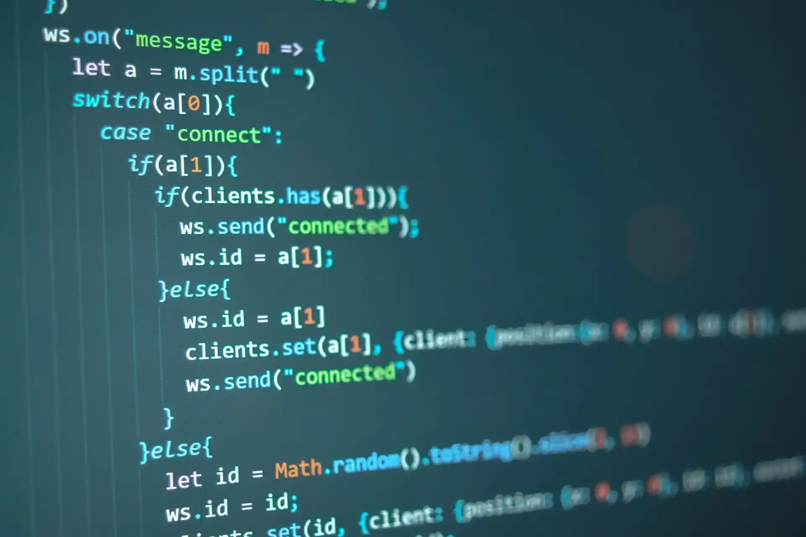

Когда я решил научиться программировать, выбор языка казался непреодолимым барьером. У меня не было знакомых в индустрии, спросить совета было не у кого, а количество вариантов сбивало с толку.

Полтора года я метался между Python, JavaScript и Ruby: читал книги, записывался на платные и бесплатные курсы, бросал и начинал заново. В итоге за это время я не научился практически ничему. Я поверхностно запомнил, что такое переменные и функции, но написать даже простейшую консольную игру не мог.

Главной проблемой были не учебные материалы, а постоянный страх ошибки. Казалось, что если я выберу неподходящий язык, то потрачу месяцы впустую, технологии устареют, а рынок откажется от специалистов моего профиля.

Все изменилось, когда я наткнулся на простую мысль: **важно не выучить конкретный синтаксис, а научиться программировать**.

## Язык — это лишь инструмент

Я вернулся к материалам The Odin Project и сосредоточился на практике. Сначала я изучал Ruby, а спустя несколько месяцев переключился на JavaScript. Этот переход наглядно подтвердил главное правило: мне не пришлось учиться разработке заново. Концепции остались прежними — изменились только ключевые слова.

Представьте человека, который умеет ездить на велосипеде и хочет научиться водить автомобиль. Он может переживать, что не удержит руль или не справится с поворотом. Но базовый принцип управления направлением движения ему уже знаком. Ему нужно освоить интерфейс управления автомобилем, а не заново формировать чувство дороги.

То же самое происходит с языками программирования. Базовые алгоритмические конструкции универсальны.

Вывод строки в консоль на Ruby:

```ruby
def say_hi
  puts "Hello World!"
end

say_hi
```

Аналогичное действие на JavaScript:

```javascript
function sayHi() {
  console.log("Hello World!");
}

sayHi();
```

Получение первого элемента коллекции:

```ruby
# Ruby
animals = ['дельфин', 'корова', 'панголин']
first_animal = animals[0]
```

```javascript
// JavaScript
const animals = ['дельфин', 'корова', 'панголин'];
const firstAnimal = animals[0];
```

Итерация по массиву:

```ruby
# Ruby
animals.each { |animal| puts animal }
```

```javascript
// JavaScript
animals.forEach((animal) => console.log(animal));
```

В каждом случае задействованы одни и те же фундаментальные основы:
- Объявление и вызов функции.
- Передача аргументов и возврат значения.
- Индексация массивов и последовательный обход элементов.

Освоив эти механизмы один раз, вы без труда перенесете их на Python, Go, Rust или любой другой стек.

## Как сделать выбор и двигаться дальше

Паралич выбора опаснее любого неудачного решения. Полгода практики на любом популярном языке дадут вам неизмеримо больше, чем полгода чтения сравнительных статей.

Если вы стоите перед выбором, обратите внимание на два практических ориентира:

1. **Доступность сильного сообщества.** Наличие открытых учебных программ, чатов взаимопомощи и открытых проектов ускоряет прогресс сильнее, чем любые теоретические плюсы синтаксиса.
2. **Востребованность на локальном или удаленном рынке.** Откройте вакансии начального уровня в интересующем регионе и оцените объем предложений для конкретного стека.

Выберите один язык, закройте вкладки со сравнениями и начните писать код каждый день.

