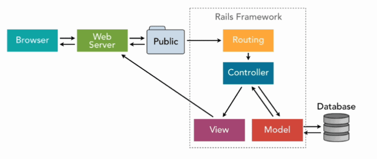
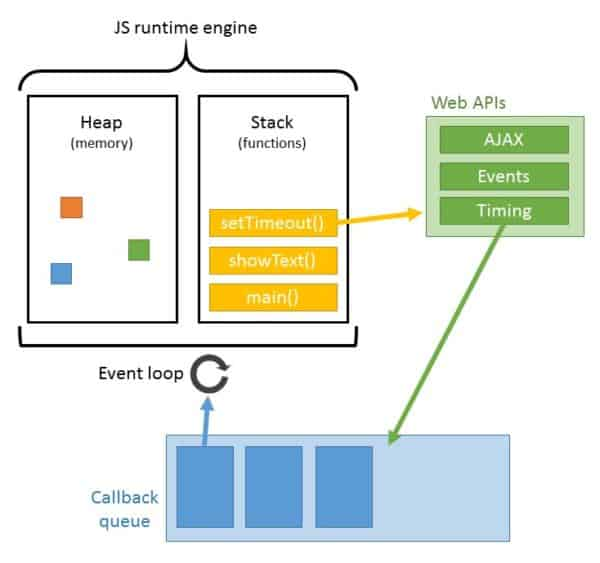
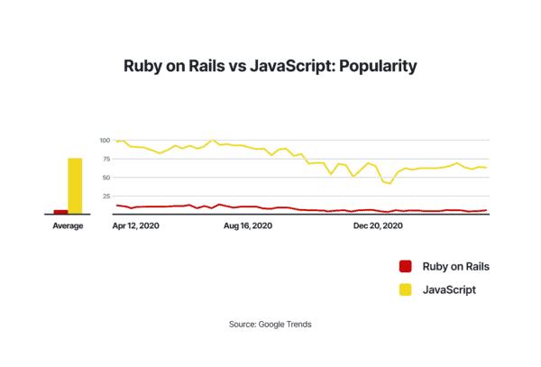

Сравнение Ruby on Rails и JavaScript часто вызывает споры, хотя изначально они решали принципиально разные задачи. Rails создавался как зрелый серверный фреймворк для быстрой разработки приложений, тогда как JavaScript был языком клиентских скриптов в браузере. Долгое время они гармонично дополняли друг друга в одном стеке.

Появление платформы Node.js и развитие компонентных библиотек изменили расстановку сил. Сегодня JavaScript превратился в универсальный язык, позволяющий писать полный стек приложения — от базы данных до динамического интерфейса.

## Архитектура и философия Ruby on Rails

Ruby on Rails опирается на принципы «соглашение главнее конфигурации» и «не повторяйся» (DRY). Вместо написания шаблонного кода для маршрутизации или подключения к базе данных разработчик следует установленным правилам именования, а фреймворк берет рутину на себя.

В основе Rails лежит классический паттерн MVC:

- **Модель (Model)** инкапсулирует бизнес-логику и управляет данными через ORM ActiveRecord.
- **Представление (View)** отвечает за рендеринг HTML-разметки и шаблонов.
- **Контроллер (Controller)** принимает HTTP-запросы, обращается к моделям и передает результат в представление.

Готовая инфраструктура Rails включает встроенные миграции баз данных, обработку фоновых задач, отправку почты и защиту от типовых уязвимостей (SQL-инъекций, CSRF и XSS). Это позволяет быстро запускать прототипы и масштабировать монолитные сервисы силами небольшой команды.

## Экосистема и универсальность JavaScript

Главное преимущество JavaScript — повсеместность. Это единственный язык, нативно поддерживаемый всеми веб-браузерами.

С появлением Node.js разработчики получили возможность использовать единый язык на клиенте и сервере. Это упрощает обмен типами данных, валидационными схемами и позволяет инженерам легко переключаться между слоями приложения:

- **Клиентская часть:** библиотеки React, Vue или Svelte формируют динамический интерфейс со сложным состоянием без полной перезагрузки страниц.
- **Серверная часть:** среды выполнения Node.js и Bun обрабатывают тысячи одновременных сетевых соединений за счет неблокирующего ввода-вывода и цикла событий (event loop).

## Ключевые различия

Выбор между Rails и JavaScript-стеком упирается в архитектурные приоритеты и скорость поставки функциональности.

### Скорость разработки и структура проекта

Rails предлагает жесткую монолитную структуру «батарейки в комплекте». Любой разработчик, знакомый с экосистемой, мгновенно ориентируется в проекте.

В экосистеме JavaScript нет единого монолитного стандарта: команда самостоятельно выбирает библиотеки для маршрутизации, работы с базой данных, валидации и авторизации. Это дает максимальную гибкость, но требует больше времени на проектирование архитектуры.

### Модель исполнения и производительность

Node.js оптимизирован для приложений реального времени, чатов, потоковой передачи данных и микросервисов с интенсивным сетевым обменом. Однопоточный цикл событий эффективно утилизирует ресурсы при операциях ввода-вывода.

Ruby on Rails традиционно использует синхронную многопроцессную или многопоточную обработку запросов. Для вычислительно сложных сценариев и стандартных CRUD-операций производительности Rails достаточно, однако приложения реального времени требуют подключения специализированных инструментов вроде ActionCable или внешних брокеров сообщений.

## Что выбрать для проекта

Технологии не обязательно противопоставлять друг другу — современная веб-разработка сочетает сильные стороны обоих подходов:

- **Ruby on Rails** незаменим для быстрого запуска MVP, сложных транзакционных систем, маркетплейсов и контентных платформ, где критична скорость проверки гипотез готовыми инструментами.
- **JavaScript и TypeScript** доминируют в приложениях с насыщенной интерактивностью, высокими требованиями к микросервисной архитектуре или при потребности в едином стеке для веб- и мобильной разработки.
- **Гибридный подход:** Rails используется как надежный бэкенд и поставщик REST или GraphQL API, а клиентская часть реализуется на современных фронтенд-библиотеках.

