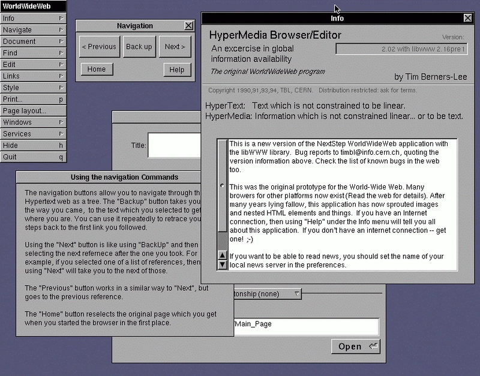
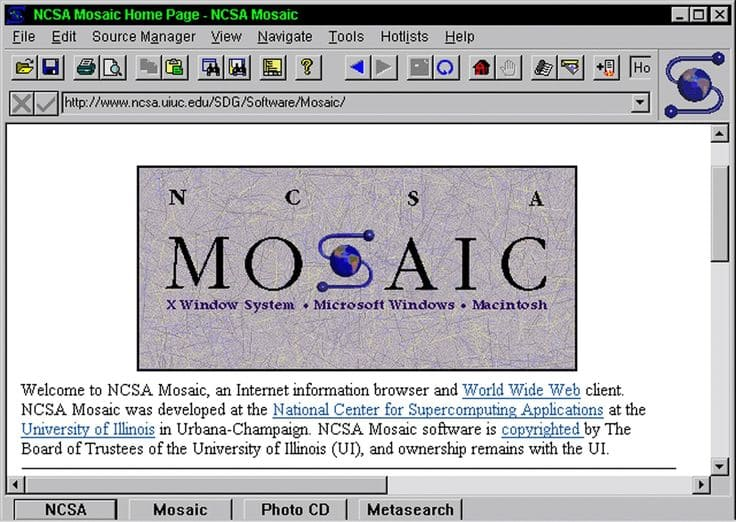
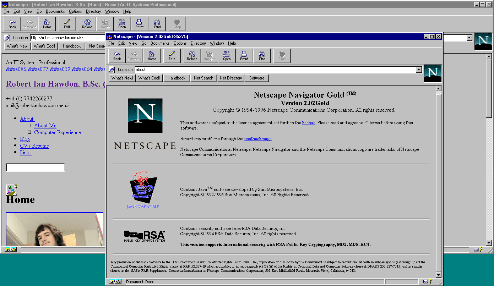
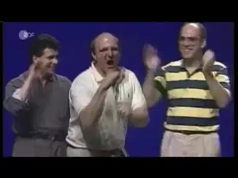
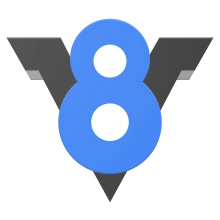
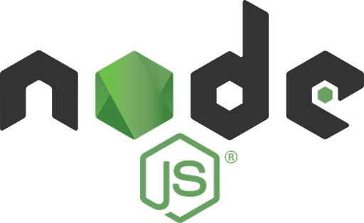
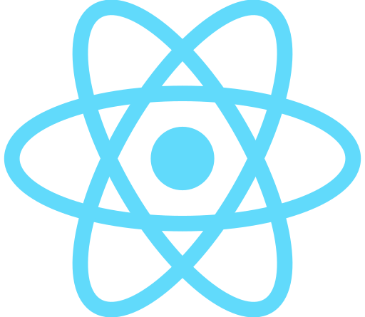

За последние 25 лет JavaScript превратился из поспешного прототипа для браузера Netscape в [самый популярный в мире язык программирования](https://survey.stackoverflow.co/2025/technology/). Вот как это произошло, насколько я понимаю...

<iframe src="https://vkvideo.ru/video_ext.php?oid=-223467206&id=456239093&hd=3" width="100%" height="388" allow="autoplay; encrypted-media; fullscreen; picture-in-picture; screen-wake-lock;" frameborder="0" allowfullscreen></iframe>

## Да будет JavaScript

_1990–1999. В этот период появился JavaScript и прошёл стандартизацию через ECMA до версии 3 (ES3)._

**25 декабря 1990 года.** В Швейцарии сэр Тим Бернерс-Ли разработал первый современный веб-браузер — WorldWideWeb (позже переименованный в Nexus). Попробуйте [его в действии](https://worldwideweb.cern.ch/).

**Декабрь 1991 года.** Принят Закон о высокопроизводительных вычислениях (так называемый «закон Гору»). Позже Альберта Гору ошибочно и с юмором приписывают «изобретение интернета».

**Январь 1993 года.** Браузер Mosaic разработан [Марком Андреессеном](https://ru.wikipedia.org/wiki/%D0%90%D0%BD%D0%B4%D1%80%D0%B8%D1%81%D1%81%D0%B5%D0%BD,_%D0%9C%D0%B0%D1%80%D0%BA) и Эриком Бина в Университете Иллинойса на средства по «закону Гору». Он становится первым массовым веб-браузером 🚀.

**Начало 1995 года.** Netscape (основанный совместно Марком Андреессеном) стремительно растёт и занимает почти 80% рынка браузеров, однако веб-дизайнерам не хватает «склеивающего» языка, чтобы сделать сайты более динамичными. Сначала они обращаются к Java, но вскоре понимают, что нужен что-то более гибкое и простое в использовании.

**Май 1995 года.** [Брендан Эйх](https://ru.wikipedia.org/wiki/%D0%AD%D0%B9%D1%85,_%D0%91%D1%80%D0%B5%D0%BD%D0%B4%D0%B0%D0%BD) приглашается, чтобы «встроить Scheme в браузер», но испытывает сильное давление, чтобы быстро создать прототип — ведь Microsoft может опередить их.

**Через десять дней...** Он создаёт язык под названием Mocha. У него синтаксис Java, функции первого класса как в Scheme, динамическая типизация как в Lisp и прототипы как в Self.

**Сентябрь 1995 года.** Язык переименовывают в LiveScript по маркетинговым соображениям.

**Декабрь 1995 года.** Его снова переименовывают — теперь в JavaScript, опять же по маркетинговым причинам.

**Август 1996 года.** Microsoft разбирает JavaScript по кусочкам и выпускает его вместе с Internet Explorer 3, но называет JScript — из-за юридических ~~маркетинговых~~ соображений.

**Ноябрь 1996 года.** Microsoft буквально уничтожает конкурентов, руководствуясь внутренней философией «принять, расширить, уничтожить» — ух, неприятно 😬. Netscape отправляет документацию для стандартизации JavaScript в ECMA International.

**Июнь** **1997 года.** Первая стандартизированная версия JavaScript (ES1) одобрена комитетом TC-39 как ECMA-262 или ECMAScript. В ней уже присутствуют многие возможности, которые мы используем сегодня: функции первого класса, объекты, прототипное наследование.

**Июнь 1998 года.** ES2 стандартизирован, почти без изменений.

**Декабрь 1999 года.** [Стандартизирован ES3](https://javascript.ru/ecma) — с поддержкой строгого равенства, обработки исключений и другими новыми возможностями. Эта версия будет доминировать следующие 10 лет.

## Тёмные века

_2000–2008. После краха доткомов JavaScript сталкивается с многочисленными неудачами, включая провал ES4._

**Март 2000 года.** Лопается пузырь доткомов.

**Вскоре после этого...** Для ES4 предлагается широкий набор функций: классы, интерфейсы, опциональные типы и другие механизмы, ориентированные на корпоративные нужды. [Дуглас Крокфорд](https://ru.wikipedia.org/wiki/%D0%9A%D1%80%D0%BE%D0%BA%D1%84%D0%BE%D1%80%D0%B4,_%D0%94%D1%83%D0%B3%D0%BB%D0%B0%D1%81) из Yahoo выражает опасения, что предложение слишком сложное и громоздкое. С ним соглашается Microsoft.

Комитет TC-39 решает параллельно разрабатывать ECMAScript 3.1 (упрощённую версию) и ECMAScript 4 (корпоративную версию). В итоге этот подход проваливается, и ES4 так и не появляется.

**Тем временем...** Internet Explorer от Microsoft доминирует, занимая около 90% рынка браузеров. Microsoft участвует в работе над ECMAScript, но в основном следует своим собственным правилам, добавляя новые функции в JavaScript по своему усмотрению. Особенно важно, что технология [AJAX](https://ru.wikipedia.org/wiki/AJAX) закладывает основу для будущих одностраничных приложений (SPA).

**Август 2006 года.** Джон Резиг создаёт библиотеку [jQuery](https://ru.wikipedia.org/wiki/JQuery). Она решает крайне раздражающие проблемы совместимости между браузерами, существовавшие в то время. Также она предлагает краткий и хорошо документированный API, устанавливая новый стандарт «удобства разработчика». На сегодняшний день jQuery остаётся самой используемой JS-библиотекой по количеству загрузок на веб-страницах.

**Сентябрь 2008 года.** Google выпускает браузер Chrome и делает открытым исходный код высокопроизводительного [движка V8](<https://ru.wikipedia.org/wiki/V8_(%D0%B4%D0%B2%D0%B8%D0%B6%D0%BE%D0%BA_JavaScript)>). Это открывает двери к новым возможностям...

## Возрождение

_2009–2015. JavaScript становится полноценным fullstack-языком, а экосистема разработки стремительно растёт._

**Май 2009 года.** [Райан Даль](https://ru.wikipedia.org/wiki/%D0%94%D0%B0%D0%BB%D1%8C,_%D0%A0%D0%B0%D0%B9%D0%B0%D0%BD) создаёт Node.js на базе проекта V8 от Google. Его уникальность — в способности выполнять неблокирующий код на сервере с помощью event loop. Это приводит к появлению парадигмы «JavaScript везде».

**Декабрь 2009 года.** Ровно через 10 лет после ES3 мы наконец получаем новую версию JavaScript — ES5. Она добавляет умеренный набор новых функций, основанных на ES3.1: строгий режим, геттеры/сеттеры, JSON.

**Октябрь 2010 года.** Появляются первые версии фреймворков [AngularJS](https://ru.wikipedia.org/wiki/AngularJS) и [Backbone](https://ru.wikipedia.org/wiki/Backbone.js). Они становятся невероятно популярными по разным причинам: Angular — декларативный и навязывает определённую архитектуру, а Backbone — императивный и минималистичный. Это знаменует начало эры современных одностраничных приложений (SPA) и постоянной смены фреймворков.

**Май 2013 года.** Facebook представляет [ReactJS](https://ru.wikipedia.org/wiki/React). В последующие годы он стремительно набирает популярность и укрепляет декларативный подход к созданию пользовательских интерфейсов, который сегодня используется во многих приложениях.

Примерно в этот же период появляются десятки других frontend-, backend- и fullstack-фреймворков: Angular, Ember, Meteor, Sails, Vue, Svelte, Mithril, Knockout, Polymer — и это лишь некоторые из них.

## Современная эпоха

_2015 — настоящее время. В ES6 появляется множество новых возможностей, изменивших способ написания кода современными JS-разработчиками._

**2015:** ES6 привносит в язык огромное количество новых функций (многие из которых изначально были частью провального ES4): let/const, стрелочные функции, классы, промисы и многое другое. Это порождает транспиляторы вроде Babel и TypeScript, позволяя разработчикам писать современный код, сохраняя поддержку старых браузеров, работающих на ES5/3.

**2016:** ES7. Появляются небольшие изменения, такие как Array.includes(). Самое главное — теперь ECMA начинает выпускать небольшие обновления ежегодно.

**2017:** ES8. Мы получаем Async/Await!

**2018:** ES9. Появляется синтаксис Rest/Spread!

**2019:** ES10. добавляет полезные нововведения, такие как метод `Array.flat()`, `Array.flatMap()`, `Object.fromEntries()`, а также поддержку `trimStart()` и `trimEnd()`, улучшая работу с массивами, объектами и строками.

**2020:** ES11. вводит оператор опциональной цепочки и nullish coalescing, упрощая работу с неопределёнными значениями.

**2021:** ES12. добавляет логические присваивания и обновлённые методы для работы со строками и числами.

**2022:** ES13. расширяет возможности классов, включая поля и методы с приватным доступом по умолчанию.

**2023:** ES14. приносит топ-уровневые await, улучшения коллекций и более гибкую обработку ошибок.

**2024:** ES15. продолжает развитие с новыми синтаксическими улучшениями, включая декораторы и упрощённую работу с промисами.

Куда движется JavaScript дальше? Заменит ли WASM JavaScript? Станет ли React устаревшим из-за микрофронтендов? Лопнет ли новый технологический пузырь?

Только время покажет. Оставайтесь с нами — часть II выйдет в 2045 году!
